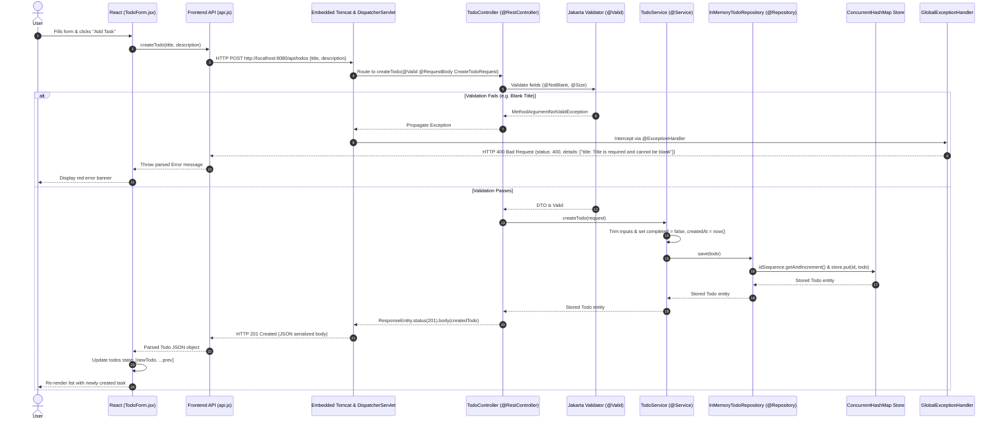
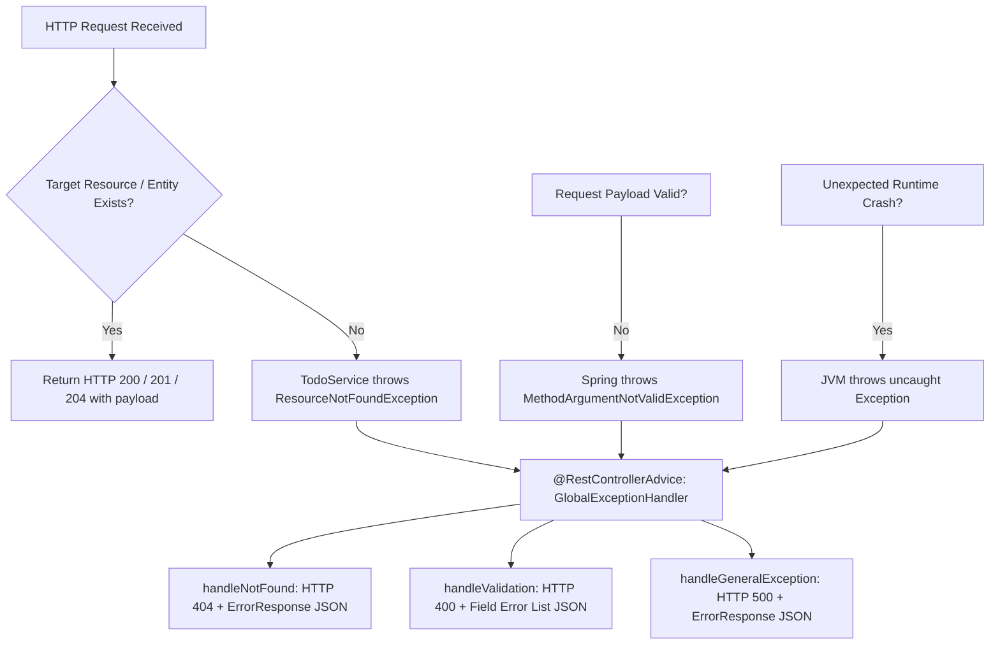

# Full-Stack To-Do List Application: Spring Boot 3 + React

A production-grade, architectural reference application designed as an educational bridge for developers transitioning from algorithmic / LeetCode / Core OOP Java to modern enterprise full-stack development.

---

## Overview

In competitive programming or LeetCode environments, Java code is largely imperative: execution begins in `public static void main`, classes are manually instantiated with `new`, dependencies are manually wired, and data structures are discarded once the algorithm terminates.

Enterprise application development follows a different paradigm: **declarative, framework-managed architectures** powered by **Inversion of Control (IoC)** and **Dependency Injection (DI)**.

This repository demonstrates how to architect a clean, layered Spring Boot 3 backend coupled with a responsive React (Vite) frontend—without requiring any external database installations.

### Key Highlights

- **Backend:** Spring Boot 3.3.x, Java 21 LTS, Embedded Tomcat, Jakarta Bean Validation.
- **Frontend:** React 18, Vite, Native CSS with design tokens, zero heavy third-party UI dependencies.
- **Data Persistence:** Thread-safe in-memory store utilizing `ConcurrentHashMap` and `AtomicLong`.
- **Architectural Rigor:** Strict Controller-Service-Repository layer isolation, DTO pattern, and centralized exception handling.
- **Zero-Setup Quickstart:** Clone and run immediately without installing PostgreSQL, MySQL, or Docker.

---

## 1. System Architecture & Request Lifecycle

### High-Level Architectural Diagram

```text
+-------------------------------------------------------------------------------+
|                               BROWSER RUNTIME                                 |
|                                                                               |
|  +-------------------------------------------------------------------------+  |
|  |                    React Application (Vite @ Port 5173)                 |  |
|  |                                                                         |  |
|  |  [TodoForm]  <--->  [App.jsx State]  <--->  [FilterBar]                 |  |
|  |                           |                                             |  |
|  |                      [TodoList]                                         |  |
|  |                           |                                             |  |
|  |                      [TodoItem]                                         |  |
|  |                           |                                             |  |
|  |                           v                                             |  |
|  |                     [api.js] (Native fetch with error parsing)          |  |
|  +---------------------------|---------------------------------------------+  |
+------------------------------|------------------------------------------------+
                               |
                        HTTP REST / JSON
                 (CORS Allowed: localhost:5173)
                               |
                               v
+-------------------------------------------------------------------------------+
|                            SPRING BOOT 3 BACKEND                              |
|                          (Tomcat Server @ Port 8080)                          |
|                                                                               |
|  +-------------------------------------------------------------------------+  |
|  | 1. Web / Presentation Layer                                              |  |
|  |    - TodoController: Handles routing, validates DTOs, returns HTTP codes|  |
|  |    - CorsConfig: Enforces Cross-Origin policies                         |  |
|  |    - GlobalExceptionHandler: Converts exceptions to JSON ErrorResponse  |  |
|  +---------------------------|---------------------------------------------+  |
|                              | (Calls service methods via interface/bean)     |
|                              v                                                |
|  +-------------------------------------------------------------------------+  |
|  | 2. Business Logic Layer                                                 |  |
|  |    - TodoService: Orchestrates rules, ID validation, timestamps, toggle |  |
|  +---------------------------|---------------------------------------------+  |
|                              | (Injected TodoRepository interface)            |
|                              v                                                |
|  +-------------------------------------------------------------------------+  |
|  | 3. Data Access & Persistence Layer                                      |  |
|  |    - InMemoryTodoRepository: Implements TodoRepository                  |  |
|  |    - ConcurrentHashMap<Long, Todo> (Thread-safe heap memory store)      |  |
|  |    - AtomicLong (Thread-safe sequential ID generator)                   |  |
|  +-------------------------------------------------------------------------+  |
+-------------------------------------------------------------------------------+
```

---

### Request Lifecycle Sequence Diagram (Mermaid)

The following sequence diagram tracks a `POST /api/todos` request from user submission in React down to the in-memory data store and back:



---

### Centralized Exception Handling Architecture

Instead of handling errors using fragmented `try/catch` blocks inside every controller endpoint, Spring MVC employs an Aspect-Oriented interception model:



---

## 2. Conceptual Guide for LeetCode / Core Java Developers

If you are proficient with data structures, algorithms, and standard object-oriented programming in Java, enterprise frameworks like Spring Boot can initially look like "magic." This section unpacks what is actually happening behind the scenes.

### 2.1 The Paradigm Shift: Imperative vs Declarative

| LeetCode / Core Java Mindset | Spring Boot Enterprise Mindset |
| :--- | :--- |
| You control the lifecycle: `main()` starts, calls functions, exits. | Framework controls the lifecycle: Spring boots, loads components, and waits for incoming HTTP events. |
| You create dependencies manually: `Scanner s = new Scanner(...)`. | Dependencies are declared via interfaces and injected automatically by the framework. |
| Objects are short-lived, transient instances in a single thread. | Classes are managed singletons shared concurrently across multiple worker threads. |
| Control flow is explicit and linear. | Control flow is declarative and annotation-driven. |

---

### 2.2 Inversion of Control (IoC) & The Spring Bean Container

#### What is Inversion of Control?
In traditional Java, your code is in control: your code calls libraries, instantiates objects, and manages when tasks run.

In **Inversion of Control (IoC)**, this relationship is inverted (known as the *Hollywood Principle*: *"Don't call us, we'll call you"*). You provide the classes and business rules, but the Spring framework decides when to instantiate them, when to wire them together, and when to execute them.

#### What is a "Bean"?
A **Bean** is simply a Java object that is instantiated, configured, assembled, and managed by the **Spring IoC Container** (`ApplicationContext`).

Instead of writing:
```java
// Traditional LeetCode style: Manual allocation
InMemoryTodoRepository repository = new InMemoryTodoRepository();
TodoService service = new TodoService(repository);
TodoController controller = new TodoController(service);
```

You place an annotation (`@Repository`, `@Service`, `@RestController`) on your class. During startup, Spring performs **component scanning**, finds these annotated classes, instantiates each one as a managed Bean, and stores them in its internal Bean Registry.

#### Bean Scope & Concurrency
By default, all Spring beans are **Singletons**—exactly one instance of `TodoController`, `TodoService`, and `InMemoryTodoRepository` exists in the entire JVM.

Because web servers like Tomcat serve multiple incoming requests in parallel threads, **Beans must either be stateless or explicitly thread-safe**:
- `TodoController` and `TodoService` are stateless (they hold no mutable instance fields).
- `InMemoryTodoRepository` maintains mutable state, so it uses `ConcurrentHashMap` and `AtomicLong` instead of `HashMap` or `long` to prevent race conditions.

---

### 2.3 Dependency Injection (DI) Without `new`

#### Why Avoid the `new` Keyword?
Consider what happens if `TodoService` directly creates its repository:

```java
// TIGHT COUPLING (Anti-pattern in enterprise architecture)
public class TodoService {
    private TodoRepository repo = new InMemoryTodoRepository(); // Hardcoded!
}
```

This violates the **Dependency Inversion Principle**:
1. `TodoService` is permanently bound to `InMemoryTodoRepository`. You cannot switch to a `PostgresTodoRepository` without editing `TodoService`.
2. You cannot unit test `TodoService` in isolation with mock data because you cannot swap out `InMemoryTodoRepository`.

#### How Spring Solves This: Constructor Injection
With Dependency Injection, `TodoService` declares what it needs in its constructor, and Spring automatically supplies it:

```java
// LOOSE COUPLING (Best Practice)
@Service
public class TodoService {
    private final TodoRepository todoRepository; // Final reference ensures immutability

    // Spring sees this constructor, finds the 'TodoRepository' Bean, and passes it in
    public TodoService(TodoRepository todoRepository) {
        this.todoRepository = todoRepository;
    }
}
```

> **Why Constructor Injection over Field Injection (`@Autowired`)?**
> In older Spring tutorials, you might see `@Autowired private TodoRepository repo;`. Modern Spring strictly prefers **Constructor Injection**:
> 1. Fields can be marked `final`, ensuring immutability.
> 2. You can instantiate `TodoService` in pure JUnit unit tests without needing to start Spring at all: `new TodoService(mockRepository)`.

---

### 2.4 Layered Architecture: Separation of Concerns

A hallmark of enterprise software is dividing responsibilities into well-defined horizontal layers:

```text
HTTP Request ---> [ Controller Layer ] ---> [ Service Layer ] ---> [ Repository Layer ] ---> [ Data Store ]
```

#### The Restaurant Analogy
- **Controller (The Waiter):** Greets customers (HTTP clients), takes orders (request DTOs), ensures the order is legible (`@Valid`), passes the ticket to the kitchen, and delivers the food with the proper etiquette (HTTP status codes like `200 OK` or `201 Created`). The waiter does not cook the meal!
- **Service (The Chef):** Prepares the food and enforces kitchen recipes (business logic). Checks whether an ingredient exists; if missing, throws an exception (`ResourceNotFoundException`). The chef does not care what kind of tables or chairs are in the dining room (protocol agnostic).
- **Repository (The Pantry Manager):** Knows how to retrieve and store raw ingredients (data access). Knows nothing about customer orders or recipes; simply executes `save`, `findById`, and `deleteById`.
- **DTOs vs Domain Model (The Menu vs The Ingredients):**
  - `CreateTodoRequest` / `UpdateTodoRequest` (DTOs): The external contract exposed to the outside world. Can include validation rules (`@NotBlank`).
  - `Todo` (Domain Model): The internal entity representing the complete state stored in memory or the database.

---

### 2.5 Annotations Cheat Sheet for LeetCode Developers

Annotations in Java are metadata tags prefixed with `@`. In Spring, annotations instruct the framework to generate boilerplate, register beans, intercept methods, or parse HTTP payloads.

| Annotation | Location | What It Does Under the Hood | Core Java / LeetCode Contrast |
| :--- | :--- | :--- | :--- |
| **`@SpringBootApplication`** | Class | Synthesizes `@Configuration`, `@EnableAutoConfiguration`, and `@ComponentScan`. Boots the Spring container and starts embedded Tomcat. | Equivalent to writing an entire bootstrap driver that scans the classpath, parses configurations, and initializes a server. |
| **`@RestController`** | Class | Combines `@Controller` and `@ResponseBody`. Tells Spring this class handles HTTP endpoints and serializes return values directly into JSON. | Eliminates manual string concatenation or Jackson `objectMapper.writeValueAsString(...)` calls in servlet handlers. |
| **`@RequestMapping`** | Class / Method | Specifies the URL path prefix (e.g. `/api/todos`) routed to this controller. | Similar to routing dispatch tables or switch statements based on URL string paths. |
| **`@GetMapping`**<br>**`@PostMapping`**<br>**`@PutMapping`**<br>**`@PatchMapping`**<br>**`@DeleteMapping`** | Method | Maps specific HTTP verbs (`GET`, `POST`, `PUT`, `PATCH`, `DELETE`) to Java methods. | Replaces manual `if (request.getMethod().equals("POST"))` branching in raw Java servlets. |
| **`@PathVariable`** | Method Parameter | Extracts dynamic path tokens (e.g. `/api/todos/{id}`) and parses them into Java types (like `Long id`). | Replaces manual string splitting (`url.split("/")[3]`) and `Long.parseLong(...)`. |
| **`@RequestBody`** | Method Parameter | Intercepts the HTTP request body and deserializes incoming JSON into a Java DTO object. | Replaces reading raw input streams and manually deserializing JSON strings. |
| **`@Valid`** | Method Parameter | Triggers the Jakarta validation engine on the incoming DTO before executing the method body. | Replaces repetitive manual checks like `if (title == null \|\| title.trim().isEmpty()) throw ...`. |
| **`@NotBlank`**<br>**`@Size`** | DTO Field | Declarative constraint annotations enforcing non-empty strings and length boundaries. | Self-documenting constraints attached directly to data models. |
| **`@Service`** | Class | Stereotype annotation marking a class as a business logic Bean in the IoC container. | Explicitly tags business logic so Spring can apply transactions, security, or profiling aspects. |
| **`@Repository`** | Class | Stereotype annotation marking a data access Bean. Automatically translates database exceptions into Spring DataAccessException hierarchy. | Tags storage layer classes; enables automatic proxying and data source management. |
| **`@Configuration`** | Class | Indicates that a class defines `@Bean` factory methods or implements Spring configuration interfaces (e.g. `WebMvcConfigurer`). | Declarative programmatic setup replacing older XML configuration files. |
| **`@RestControllerAdvice`** | Class | Intercepts exceptions thrown by any `@RestController` across the entire application. | Global try/catch interceptor; decouples controllers from error-handling logic. |
| **`@ExceptionHandler`** | Method | Specifies which exception class (e.g. `ResourceNotFoundException.class`) triggers this error-mapping method. | The catch block for `@RestControllerAdvice`, turning exceptions into HTTP responses. |

---

## 3. Project Directory Map & File Guide

```text
spring_to_do_list/
├── backend/
│   ├── pom.xml                                   # Maven dependency build descriptor
│   ├── mvnw                                      # Maven wrapper shell script (Linux/macOS)
│   ├── mvnw.cmd                                  # Maven wrapper batch script (Windows)
│   ├── .mvn/wrapper/                             # Maven wrapper configuration & JAR
│   └── src/
│       ├── main/
│       │   ├── java/com/example/todolist/
│       │   │   ├── TodoListApplication.java      # Application entry point (@SpringBootApplication & main)
│       │   │   ├── config/
│       │   │   │   └── CorsConfig.java           # Cross-Origin Resource Sharing configuration
│       │   │   ├── controller/
│       │   │   │   └── TodoController.java       # REST endpoints for CRUD operations
│       │   │   ├── dto/
│       │   │   │   ├── CreateTodoRequest.java    # Validation DTO for POST payload
│       │   │   │   ├── UpdateTodoRequest.java    # Validation DTO for PUT payload
│       │   │   │   └── ErrorResponse.java        # Standardized JSON error response payload
│       │   │   ├── exception/
│       │   │   │   ├── ResourceNotFoundException.java # Domain exception for missing entity (404)
│       │   │   │   └── GlobalExceptionHandler.java    # Centralized @RestControllerAdvice
│       │   │   ├── model/
│       │   │   │   └── Todo.java                 # Domain entity model (id, title, description, completed, createdAt)
│       │   │   ├── repository/
│       │   │   │   ├── TodoRepository.java       # Repository abstraction interface
│       │   │   │   └── InMemoryTodoRepository.java # Thread-safe ConcurrentHashMap implementation
│       │   │   └── service/
│       │   │       └── TodoService.java          # Core business logic and layer orchestration
│       │   └── resources/
│       │       └── application.properties        # Server port, logging levels, application metadata
│       └── test/java/com/example/todolist/
│           ├── controller/
│           │   └── TodoControllerTest.java       # MockMvc integration tests for REST API endpoints
│           └── service/
│               └── TodoServiceTest.java          # JUnit 5 unit tests for business logic
├── frontend/
│   ├── package.json                              # Node dependencies and Vite run scripts
│   ├── vite.config.js                            # Vite bundler & React plugin configuration
│   ├── index.html                                # Single Page Application HTML entry point
│   └── src/
│       ├── main.jsx                              # React DOM mounting entry point
│       ├── App.jsx                               # Top-level container component & state manager
│       ├── App.css                               # Component layout, card styles, transitions
│       ├── index.css                             # CSS variables, typography, reset rules
│       ├── services/
│       │   └── api.js                            # Async HTTP client interfacing with Spring Boot API
│       └── components/
│           ├── TodoForm.jsx                      # Form component with validation for creating todos
│           ├── TodoItem.jsx                      # Individual todo card with inline edit and delete
│           ├── TodoList.jsx                      # List container rendering items or empty state
│           └── FilterBar.jsx                     # Filter pill tabs with live badge counters
├── docs/
│   └── superpowers/
│       ├── specs/
│       │   └── 2026-09-21-spring-boot-react-todo-design.md # Full design and architectural spec
│       └── plans/
├── RUNNING_GUIDE.md                              # Exhaustive step-by-step developer runbook & curl guide
└── README.md                                     # System overview, architecture diagrams, & educational guide
```

---

### Detailed File Responsibilities

| File Path | Role & Key Concepts |
| :--- | :--- |
| `TodoListApplication.java` | Entry point of the Spring Boot application. Contains `main()` which calls `SpringApplication.run()` to start embedded Tomcat on port 8080. |
| `CorsConfig.java` | Configures `WebMvcConfigurer` to permit browser requests from `http://localhost:5173` and `http://127.0.0.1:5173` with all CRUD methods. |
| `TodoController.java` | Exposes REST endpoints (`/api/todos`). Handles HTTP status codes (`200`, `201`, `204`), path variables (`@PathVariable`), and JSON deserialization (`@RequestBody`). |
| `CreateTodoRequest.java` | DTO preventing invalid creation requests using Jakarta `@NotBlank` and `@Size(max = 100)`. |
| `UpdateTodoRequest.java` | DTO used for PUT modifications ensuring title is present and description is within bounds. |
| `ErrorResponse.java` | Immutable record/class containing `timestamp`, `status`, `error`, `message`, and `details` list for clean client consumption. |
| `ResourceNotFoundException.java`| Unchecked `RuntimeException` thrown by the service layer when a requested To-Do ID does not exist. |
| `GlobalExceptionHandler.java` | `@RestControllerAdvice` converting `ResourceNotFoundException` into `404 Not Found` and `MethodArgumentNotValidException` into `400 Bad Request`. |
| `Todo.java` | The internal domain model holding `id`, `title`, `description`, `completed`, and `createdAt` timestamp. |
| `TodoRepository.java` | Interface defining storage operations (`findAll`, `findById`, `save`, `deleteById`, `clear`). Enables dependency inversion. |
| `InMemoryTodoRepository.java` | Implements `TodoRepository` using `ConcurrentHashMap<Long, Todo>` and `AtomicLong`. Pre-populates 3 starter items. |
| `TodoService.java` | Orchestrates operations, enforces business rules, manages ID checks, and injects `TodoRepository` via constructor. |
| `TodoControllerTest.java` | MockMvc integration test suite validating REST status codes, JSON responses, and validation rejections. |
| `TodoServiceTest.java` | Fast JUnit 5 unit tests validating service operations and exception handling. |
| `frontend/src/services/api.js` | Modular HTTP client wrapping `fetch` to communicate with backend endpoints and extract error details. |
| `frontend/src/App.jsx` | Coordinates state (`todos`, `filter`, `loading`, `error`), lifecycle data loading, and event dispatchers. |
| `frontend/src/components/TodoForm.jsx` | Captures user title/description input, performs client-side validation, and triggers submission. |
| `frontend/src/components/FilterBar.jsx` | Provides tabbed filtering (*All*, *Active*, *Completed*) with real-time count badges. |
| `frontend/src/components/TodoList.jsx` | Renders cards or displays a helpful empty state when no items match the selected filter. |
| `frontend/src/components/TodoItem.jsx` | Renders an individual todo card with toggle checkbox, inline editing form, relative date formatting, and delete confirmation. |

---

## 4. How to Run the Application

For complete, step-by-step instructions on running both the backend and frontend in terminal and VS Code, running automated tests, testing with copy-paste `curl` commands, and troubleshooting ports or CORS, refer to the companion guide:

👉 **[Complete Developer Running Guide (RUNNING_GUIDE.md)](RUNNING_GUIDE.md)**

